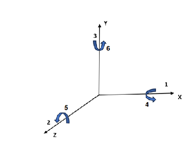
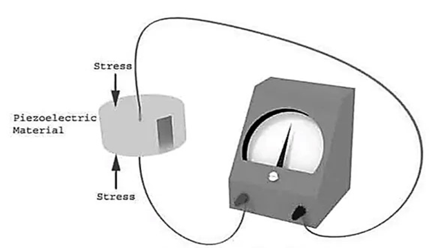

## Piezoelectric transducer

A piezoelectric transducer (also known as a piezoelectric sensor) is a device that uses the piezoelectric effect to measure changes in acceleration, pressure, strain, temperature or force by converting this energy into an electrical charge.
A transducer can be anything that converts one form of energy to another. A piezoelectric material is one in which an electric potential appears across certain surfaces of a crystal if the dimensions of the crystal are changed by the application of a mechanical force. This potential is produced by the displacement of charges. The effect is reversible, i.e., conversely, if a varying potential is applied to the proper axis of the crystal, it will change the dimensions of the crystal thereby deforming it. This effect is known as piezoelectric effect. Elements exhibiting piezoelectric qualities are called as electro- resistive elements.
Piezoelectric effect is the ability of certain materials to generate an electric charge in response to applied mechanical stress. The word piezoelectric is derived from the greek piezein, which means to squeeze or press, and piezo, which is greek for “push”.

One of the unique characteristics of the piezoelectric effect is that it is reversible, meaning that materials exhibiting the direct piezoelectric effect (the generation of electricity when stress is applied) also exhibit the converse piezoelectric effect (the generation of stress when an electric field is applied).
When piezoelectric material is placed under mechanical stress, a shifting of the positive and negative charge centers in the material takes place, which then results in an external electrical field. When reversed, an outer electrical field either stretches or compresses the piezoelectric material.
The piezoelectric effect is very useful within many applications that involve : 

-	Production and detection of sound 
-	Generation of high voltages
-	Electronic frequency generation
-	Microbalances,
-	Ultrafine focusing of optical assemblies

 Common piezoelectric materials include Rochelle salts, ammonium dihydrogen phosphate, lithium sulphate, dipotassium tartrate, potassium dihydrogen phosphate, quartz and ceramics A and B. Except for quartz and ceramics A and B, the rest are man-made crystals grown from aqueous solutions under carefully controlled conditions. The ceramic materials are polycrystalline in nature. They are, basically, made of barium titanate. They do not have piezoelectric properties in their original state but these properties are produced by special polarizing treatment.
 
The piezoelectric effect can be made to respond to (or cause) mechanical deformations of the material in many different modes. 

The modes can be : 

-	Thickness expansion
-	Transverse expansion
-	Thickness shear
-	Face shear
	
The mode of motion affected depends on the shape of the body relative to the crystal axis and location of the electrodes. Mechanical deformation generates a charge and this charge appears as a voltage across the electrodes.

The voltage is E = Q / C.

The piezoelectric effect is direction-sensitive. A tensile force produces a voltage of one polarity, while a compressive force produces a voltage of opposite polarity.

The magnitude and polarity of the induced surface charges are proportional to the magnitude and direction of the applied force F. The polarity of induced charges depends upon the direction of applied force.

Charge Q = d &times; F coulomb ………(i)

where, 

d = charge sensitivity of the crystal,

F = applied force N,

The force F causes a change in thickness of the crystal.

F = ( A E / t ) &times; &Delta; t  ………(ii)  
where,  

A = area of crystal (m2),

t = thickness of crystal (m),

E = Young's modulus (N / m2)

From eqn (i) and (ii) we have, charge   

Q = d A E( &Delta; t / t )       ………(iii)

The charge at the electrodes gives rise to an output voltage E0

Voltage E0 = Q / Cp             ………(iv)

where, 

Cp = capacitance between electrodes,

Cp = &epsilon;r &epsilon;0 A / t       ………(v)
  
From Eqn ( i ), ( iv ), ( v )   
E0 = Q / Cp = d F / &epsilon;r &epsilon;0 A / t  = ( d t / &epsilon;r &epsilon;0 ) &times; F / A   ………..(vi)
	  
 But F / A = P = pressure or stress in N/m²
 
E0= ( d t F / &epsilon;r &epsilon;0 A )    ……….(vii)                      

= g t P                             ……….(viii)
							
Where, 

g = d / &epsilon;r &epsilon;0  ……….(ix) 
  
'g' is the voltage sensitivity of the crystal. This is constant for a given crystal cut. Its units are Vm/N  
 Now g = E0 / t P = ( E0 / t ) / P  ……….(x)      
 
But E0 / t = electric field strength, V/m
  
Let   &epsilon; = E0 / t = electric field
                   
g = electric field / stress = &epsilon; / P   ……….(xi)

The two main families of constants i.e. the ‘d’ constants and ‘g’ constants are considered. For barium titanate the commonly used constants are d33 and g33

g33 = field produced in direction 3 / stress applied in direction 3
       
g33 = ( E0 / t) / ( F / A )     ……….(xii)
            
Voltage Output 
    
E0 =  g33 × ( F / A) × t   =  g33 t P      ……….(xiii)    

Thus, if g is known for a particular material, the voltage output per unit stress can be calculated by knowing the value of  t.

### Properties of barium titanate and quartz :  

### Properties of piezoelectric crystals : 
- The materials used in the construction of piezoelectric crystals or piezoelectric materials are quartz, rochelle salt, dipotassium tartrate, lithium sulphate, barium titanate, etc. The most required properties of these materials are stability, insensitivity to changes in humidity, insensitivity to changes in temperature, high output, ability to be formed into a usable component or desirable shape
- When compared to all other materials, quartz has the highest stability but provides low output. Whereas the material called Rochelle salt provides high output but its stability is low and is sensitive to humidity and temperature variations. Therefore, it requires some protection against moisture and the operating range of temperature is below 45°C
- Since the barium titanate (one of the piezoelectric materials) is polycrystalline, it can be formed into different types of shapes and sizes. Also, these materials have a very high dielectric constant
- Synthetic materials possess very high voltage sensitivity
- The natural crystals must have low leakage and very high thermal and mechanical stability
- The piezoelectric crystals have high input impedance

### Construction :
- A piezoelectric transducer consists of quartz crystal, which is made from silicon and oxygen arranged in crystalline structure (SiO2)
- Generally, unit cell of all crystals is symmetrical but in piezoelectric quartz crystal, it is not
- Piezoelectric crystals are electrically neutral
	
### Working Principle :

- A piezoelectric transducer is based on the principle of the piezoelectric effect
- The word piezoelectric is derived from the Greek word piezen, which means to squeeze or press
- The piezoelectric effect states that when mechanical stress or forces are applied to quartz crystal, they produce electrical charges on the quartz crystal surface
- The rate of charge produced will be proportional to the rate of change of mechanical stress applied to it
- Higher will be stress, higher will be voltage

-	The electric voltage produced by a piezoelectric transducer can be easily measured by the voltage measuring instruments
-	Since this voltage will be a function of the force or pressure applied to it, we can infer what the force/pressure was from the voltage reading
-	In this way, physical quantities like mechanical stress or force can be measured directly by using a piezoelectric transducer
	
### Uses : 
 - The desirable properties expected out of a piezoelectric material are stability, high output, insensitivity to temperature variations, insensitivity to variations in humidity and also the ability to be formed into a usable component. Undoubtedly the most stable material is quartz. However, its output is low. Rochelle salt, on the other hand, provides the highest output out of any of the piezoelectric materials. But it requires protection from moisture and hence cannot be used above a temperature of 45°C.
Because of its stability, quartz is commonly used for stabilizing electronic oscillators. The crystal is ground to proper shape and is connected in an appropriate electronic circuit whose frequency is controlled by it
 - The use of piezoelectric transducer elements is confined primarily to dynamic measurements. The voltage developed by application of strain is not held under static conditions. Hence, the elements are primarily used in the measurement of such quantities as surface roughness and in accelerometers and vibration pickups

-  Ultrasonic generator elements also use barium titanate, a piezoelectric material. Such elements are used in industrial cleansing apparatus and also in underwater detection systems known as sonar

### Applications :
- The earphones we use for hearing songs or watching videos make use of a piezoelectric transducer. The piezoelectric transducer produces sound waves as an output for a given electric signal from the mobile phone
- In the modern medical field, ultrasonic imaging uses the piezoelectric transducer
- A seismograph that measures vibrations makes use of a piezoelectric transducer
- On roads, piezoelectric transducers are laid. Whenever there is any movement on the road, vibrations are produced. This vibration is an input for the piezoelectric transducer and an electric voltage is harvested using this
- Piezoelectric transducers are used for dynamic pressure measurement and dynamic vibration measurement too
- In industries to know the varying force or pressure, piezoelectric transducers are used

### Advantages :
- Piezoelectric transducers are a kind of active transducers and hence they do not need any electric supply for their working
- Piezoelectric transducers have a good high-frequency response and hence piezoelectric transducers are used for wide applications because of their quick response
- Piezoelectric sensors are compact in size, which is very beneficial while designing small circuits

### Limitations :
- It is not suitable for measurement in static condition
- It is affected by temperatures
- The output is low, so some external circuit is attached to it
- It is very difficult to give the desired shape to this material and also desired strength

